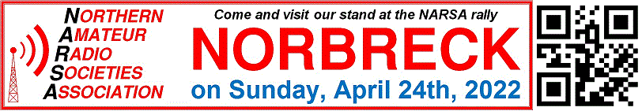

# Widnes & Runcorn Amateur Radio Club

This website is under construction.

For information, please contact [info@wararc.org.uk](mailto:info@wararc.org.uk) or come and visit us at the Blackpool rally on 24 April:

[QRZ page](https://www.qrz.com/db/g7hoa)

## Club meetings

We meet on alternate Tuesday nights between 19:30 and 21:30.


### Location
[Lostock Sports & Social Club](http://www.lostockclub.co.uk/), Works Lane, Northwich, Cheshire, CW9 7NW

[Directions](https://www.google.com/maps/dir/?api=1&destination=CW9+7NW)

## Training courses

The club holds training for all three levels throughout the year:

 * [Foundation](foundation-course.html)
 * [Intermediate](intermediate-course.html)
 * Full

### Training dates

 * The next Foundation course is TBC
 * The next Intermediate course is TBC
 * The next Full revision class is TBC
