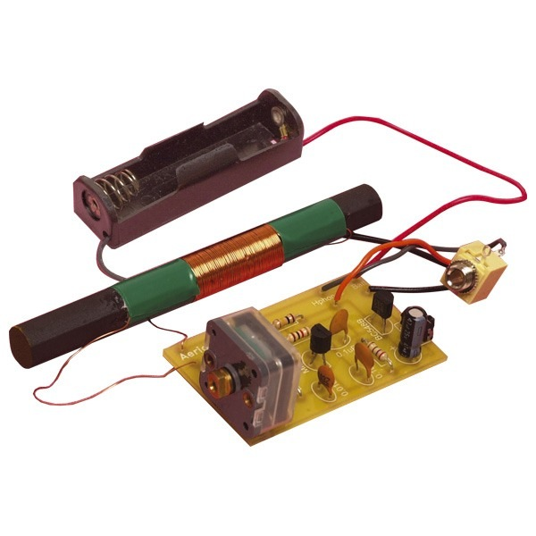

# Intermediate Course

The Intermediate licence is the second rung up the Amateur Radio ladder.

Our Intermediate Courses are usually run over 2 weekends, either a Saturday or a Sunday the first weekend with the 2nd weekend being a full weekend, with the exam usually mid-afternoon on 2nd Sunday.

The course is run on smaller numbers than the Foundation and this leads to a more relaxed course, Lunch arrangements are still the same!

You will need to acquire the course book **"Intermediate Licence - Building on the Foundation"**.

This book contains everything you will need for the course, it is priced at £6.99 (£5.24 if you’re an RSGB Member) and is available from the [RSGB Shop](http://www.rsgbshop.org/acatalog/Online_Catalogue_Training_19.html).

The course builds on everything that you learnt in the Foundation course, however while there are no on-air practicals the course has a more hands on approach than the Foundation, as there are assessments carried out at regular periods during the weekend, in order to back up what you've learnt in the course.

There are also practical elements – prior to the pandemic these were mandatory, however that is no longer the case but we still feel they’re of benefit so we’ll still be inviting you to take part in them:

1. Attach a PL-259 or a BNC to coax feeder and test
2. Wire a 3-Pin Mains Plug
3. Basic soldering
4. Calibrate a VFO (Variable Frequency Oscillator)
5. Build a Radio related electronic kit

Assessments 1-4 will be done during the course. The PL259 and 3-pin Mains plug will be done under supervision.

It’s assumed assessment 5 will be done either before the course starts or in the week between the 2 weekends. Although you are allowed to choose the kit you build, it must be something radio related. One popular choice is an AM receiver.

## AM receiver

This circuit is based around the MK484, and is very simple to build. Build time of around an hour.

All components are included in the kit, including a professionally produced PCB. All you need to supply are the headphones!

Cost for each kit is £7.00 each and they are available from the club.

You will also need to build the Simple DC Circuit, that is described in the 'Intermediate Book', as this will help you to do the experiments, measurements etc that follow some of the presentations you’ll watch and take part in  during the weekend.

The 'Simple DC Circuit' is available in kit form for £4.00 from the Club.

The rest of the course is done over a weekend, in much the same way as the Foundation course is, except there are smaller groups! During that weekend, you will do theory backed up by some practical tests, and will have to demonstrate (and possibly fault-find) your kit.

Like the Foundation course the exam (and we can call it that now!) is taken on-line on Sunday afternoon - it consists of a 1 hour 30 minute - 46 multi-choice questions. Again, like the Foundation your answers will appear a couple of seconds after submitting your answers. You’ll see immediately how you got on and RSGB HQ will verify them and send you your official pass certificate. Once you have that you’re on your way to that nice new 2E0 call sign!

That only leaves the Advanced and you’re at the top of the ladder.
